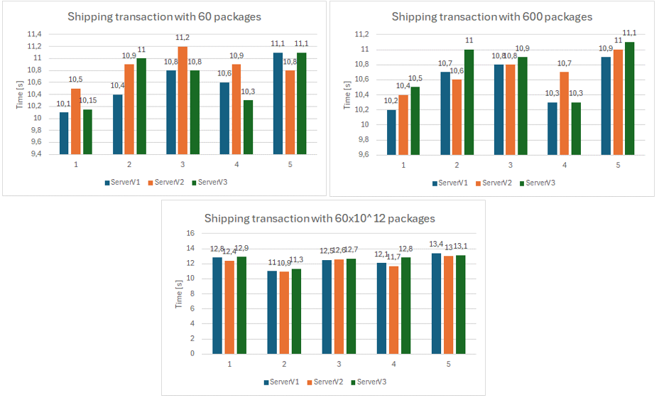

# CloudGuardian
Welcome to our Final Course Project: "CloudGuardian - Cloud Security Proposal with Blockchain"!

# Abstract
Today, data storage and security are essential in the wake of the growth of cloud computing that has been driven by technological advances, with greater importance attached to the privacy and ownership of user data when it comes to the adoption of cloud services by companies and individuals. A 48% increase in cloud-based threats over the past year has underlined the urgency of protecting against the growing risks of cyber-attacks, while a recent analysis showed an increase in such attacks. 

To combat these problems, we propose integrating Ethereum blockchain technology and the PostgreSQL database located in the cloud to enable bidirectional alignment of data and control of access mechanisms. This involves setting up an Ethereum node, writing smart contracts using Solidity, building a backend system and securing these methods. According to the results we received from the tests carried out under adaptive traffic control conditions during the implementation of the architecture, we can confirm that our suggestion makes it possible to guarantee a higher level of security due to the decentralization of the data. Therefore, our conclusion regarding this proposal is its usefulness and strength in information security.

KEYWORDS: Blockchain; Cloud; Database; Ethereum; PostgreSQL; Security.

# Introduction
The aim of the project is to combine cloud databases with blockchain technology to store and protect information (in cloud computing). The main idea is to connect PostgreSQL databases to the Ethereum blockchain to guarantee better data integrity and access control mechanisms. By taking this route, we can have decentralized storage along with clear (or unambiguous) data transmission, which allows people to have full control over their personal data while maintaining its confidentiality. The report describes the methods used. The report outlines the methodology, including smart contract development, backend and frontend application creation, permission logic implementation, and testing procedures.

Its major objectives include establishing a durable system that enables the blockchain network to interact with cloud databases, putting in place access control mechanisms for safeguarding user rights to privacy as well as authentication and authorization provisions so that the integrity of information could be maintained due to such things like unchangeable nature of this technology. We will design a user-friendly web interface with options to log in or register for an account and features that allow access to and update information. There will be a testing phase to check if the project is feasible and evaluate the efficiency of algorithms used in various parts of the project, besides identifying ways for it to be made better.

This project was inspired by the increasing use of cloud computing for data storage and management, along with the growing cybersecurity threats that organizations face. As a result, many organizations have shifted their activities to cloud technology due to its associated benefits, such as affordability and accessibility. However, cloud databases encounter significant challenges related to security, compliance, and data privacy. To address these challenges, this project aims to create a secure and transparent way to store data by combining blockchain technology with cloud database systems. The immutable and decentralized nature of blockchain will help ensure data integrity, improve access control, and reduce the risk of tampering or unauthorized access.

# Methodology
To achieve the proposed objectives, the project will be divided into several stages:

- Environment Configuration: An Ethereum node connected to the Sepolia Testnet (test network that allows the development of programs without the need for expenses) will be configured to interact with the blockchain. Furthermore, PostgreSQL will be used as the database management system, requiring its creation and subsequently a dataset for data inclusion. The ER diagram is available in the folder.

- Smart Contract Development: A smart contract will be developed in the Solidity language for the Ethereum blockchain. This contract will be responsible for storing the data and defining access permissions.

- Backend Application Development: A backend application will be developed in a language to be defined, be it Python, Java or JavaScript. This application will be responsible for integrating PostgreSQL and the Ethereum blockchain, interacting with the blockchain allowing the sending and retrieval of data bidirectionally.

- Permission Logic Implementation: Permission logic will be implemented in the backend application to control access to data stored on the blockchain. This will be done based on user roles, which will be defined in a table in PostgreSQL.

- Frontend Application Development: User-friendly Web interface to facilitate interaction between the customer and the system, including features such as login, account creation and data management (interaction with database and blockchain).

- Testing and Validation: The solution will be tested and validated in different scenarios to ensure its operation, where the actual implementation scenario will refer to a project called "Adaptive Traffic Control Using Cooperative Communication Through Visible Light". This scenario proposes communication between vehicles and infrastructures (V2V, V2I and I2V) through headlights, lampposts and traffic signs, offering a challenging and realistic environment to validate, evaluate the robustness and adaptability of our system.

# Proposed Architecture
Basically, the system is designed to securely store confidential data, such as in this project's scenario, vehicle information, in a PostgreSQL type database hosted in the cloud. This will require backend programming to ensure smooth interaction between the database and smart contracts deployed on the Ethereum blockchain.
The Ethereum blockchain has a testnet called Sepolia for the purpose of blockchain technology. To make it easier for us deploy and manage our block chains networks, we use the Alchemy provided by the blockchain as a service (BaaS).
The Ethereum blockchain employs Proof of Stake (PoS) consensus algorithms and introduces smart contracts, which automate processes based on predefined conditions, ensuring transparency and integrity within the system. It is possible to observe in Figure, the first prototype proposal developed, which aims to merge blockchain technologies and cloud databases.

It is possible to observe in the next Figure, a flowchart that represents the general functioning of our system based on user management and data management. It describes the decisions and conditional paths that determine execution based on user input, and includes time management elements, allowing for scheduled tasks to happen periodically.

# Entity Relationship Diagram
An Entity Relationship Diagram (ERD) visually represents the relationships between database entities. It is crucial to understand the database structure and facilitate communication between stakeholders during planning and design. ERD's help identify entities, attributes and relationships between entities, thus enabling efficient database normalization and documentation. In this way, it is understood to be vital for the design, management and optimization of the database system of this project.
It is possible to understand in Figure the relationships between entities and their associations. For greater detail on the creation of each table. Integration with database tools speeds up development processes, with Dia software being used for this development.

# Smart Contract
The insertion of smart contracts into the blockchain network is carried out through a deployment process, which involves compiling the insert_contract contract source code and sending a special transaction to the Ethereum network to deploy the contract. Once deployed, we return the contract address so we can interact with it. 
It is possible to observe in Figure, the source code for implementing the contract on the Ethereum network.

A contract called DataStorage was created with a data structure to store vehicle information, such as registration number and ID of the respective device that captured it. This contract consequently includes methods to interact with this data to store new data on the blockchain, and on the other hand another function to responsible for retrieving this information in a secure and transparent way. 
When deployed on the blockchain, the smart contract becomes immutable and can be invoked by any user to perform specific operations. The use of events allows other interested parties in the network to be notified whenever new data is stored, thus allowing several advantages such as the impossibility of falsifying data on the network.
It is possible to observe in the next Figure, the source code developed for the smart contract that allows interaction between the Ethereum network and the project system.

# Prerequisites

For system operation on your local machine for development and testing purposes, you need to install the following software:
- Node.js (server-side JavaScript execution environment on a server machine, no browser required);
- npm (Node Package Manager);
- Express.js (express - framework for Node.js provides resources for building web servers);
- JSON Web Token (jsonwebtoken - Internet standard for creating data with signature and/or optional encryption whose payload contains JSON);
- Bcrypt (bcrypt - encryption library designed for Node. js);
- HardHat (helmet - Compile and deploy smart contracts);
- PostgreSQL (pg - ElephantSQL for cloud database);
- MetaMask (Ethereum Wallet with SepoliaEth Testnet).

# Analysis Results
The project is expected to result in a functional and robust solution for the integration between the Ethereum blockchain and PostgreSQL. The solution will allow secure and transparent data storage, with the guarantee of integrity provided by blockchain and the query efficiency.

- Latency
-- After executing the program, we observed that there is a direct relationship between the amount 
of data to be transacted and latency, in which it appears that the more data needs to be transacted 
between the blockchain and the database, the longer it takes to be extracted. and confirmed by the 
blockchain network. This problem was already expected by the group, but the data security benefits 
offered by the program compensate, making it a possible solution.

- Transaction Fee
-- There is a direct relationship between the amount of data to be transacted between the 
blockchain and the database (associated with latency), it refers to the more data that needs to be 
transacted, that is, mined and confirmed by the blockchain network, the higher the cost will be. final 
transaction fee for this data. In this project, as previously mentioned in other chapters, one of Ethereum's 
test networks, Sepolia, was used for its development. In this way, the costs associated with transactions 
are null and paid for by non-real monetary values.

The results indicate that ServerV1 is the most efficient in terms of transaction speed, making it suitable for applications that require high responsiveness. ServerV2 performance suggests the need for specific optimizations, whether at the hardware or software level, to reduce transaction times and improve overall system efficiency.
ServerV1 had the lowest transaction times across all metrics, indicating high efficiency in communication and transaction processing. ServerV3 had moderate transaction times, suggesting reasonable but lower performance than ServerV1. ServerV2 had the highest transaction times, suggesting possible inefficiencies in the hardware or software configuration that need to be investigated. It is possible to observe in Figures.

In the first figure, we can observe that the transaction time increases as the data volume grows. However, the difference in transaction time across different servers is minimal, with about a 1 or 2 seconds difference between transactions involving 60 packages and those involving 60x10^12 packages. Consequently, it is difficult to determine which server version is superior in terms of transaction time for shipping.

The secound figure data ServerV2 is the best choice for recovery transactions, as it shows consistently a recovery time of 0 seconds across all transaction sizes.

As we can see in the first figure, serverV1 shows consistently the lowest memory consumption across all transaction sizes, with equal CPU and Disk consumption compared to the other servers. Therefore, ServerV1 is the best choice for shipping transactions when it comes to energy consumption.

When analyzing the graphic of the secound figure, we can conclude that serverV1 is again the best choice, for recovery transaction when it comes to energy consumption.

The first figure, tells us that serverV2 has a lower CPU consumption than the other versions, however serverV3 has a lower memory consumption. We can conclude that serverV2 is the best choice when shipping transactions for energy consumption on a personal computer.

The secound figure shows us that serverV1 used the most CPU and memory during send transactions on personal PCs, serverV2 demonstrated lower CPU usage but similar memory usage as ServerV1. ServerV3 showed balanced CPU and memory consumption, suggesting better suitability for operations on personal PCs. We can conclude that serverV2 is the best choice when recovering transactions for energy consumption on a personal computer.

In Solidity, strings can support up to 2^256 − 1 bytes theoretically. However, practical concerns like gas costs or the block gas limit enforced by Ethereum significantly limit efficient on-chain data storage. In Ethereum, gas prices are mostly determined by the volume of information that is placed in storage. When we store a longer string, every character is 4 bytes thus increasing the size of the data and consequently escalating the expenses. 
Considering that 'x' represents the gas price per byte and 'y' represents the number of packages to be stored in a string, we can create an equation depending on the gas price and the number of packages (set of 36 characters) in a string:
 - String length = 36 * 4 * y = 144y bytes.
 - Gas price = 144yx.
In theory, we have a limitation of ((2^256 – 1) )/144  packages in every transaction to the blockchain. However, in a practical way this is not reliable because of the gas price, it’s needed to achieve this type of transaction.

# Conclusion
Throughout this project, our main goal was to tackle the challenges that come with data security in cloud-based networks. We've been exploring the potential of combining blockchain technology with cloud databases, specifically by using the Ethereum blockchain alongside PostgreSQL databases. This approach shows promise in enhancing data integrity and access control mechanisms.

Looking back on our journey, we've achieved significant milestones in our efforts to create a more secure and transparent data storage environment. The successful implementation of smart contracts, algorithmic optimizations, and seamless integration between blockchain and cloud databases played a crucial role in the project's success.

Our solution not only enables smooth interaction between blockchain and cloud databases, but also addresses important issues like user privacy, authentication, authorization, and data integrity. By implementing robust security measures such as data encryption and access control mechanisms, we've bolstered the overall security of the system. Furthermore, by optimizing performance and scalability, we've overcome the challenges typically associated with integrating blockchain and cloud databases. Techniques like connection pools have greatly improved system efficiency and responsiveness, resulting in a smoother and more reliable user experience.

With the completion of this project, the integration of Ethereum blockchain technology and the PostgreSQL database presents an exciting opportunity for immediate implementation. It ensures data security and integrity in distributed environments like the cloud. Despite the challenges we faced during development, the benefits offered by our solution, especially after optimizations, have overcome any remaining obstacles, making it a viable and promising option in the current market.

The results presented in the previous chapter clearly demonstrate that through the implementation of smart contracts and synchronization between the two environments, we've achieved transparency and improved security in data storage. However, it's important to note that this project is just the first step in an ongoing journey of innovation and improvement. We acknowledge that there are significant opportunities to further expand and enhance the integration between blockchain and cloud databases.

# Future Work
Looking ahead to the academic future, we're fully aware of the ongoing opportunities for improvement and expansion within this project. Our focus is on making our algorithms more efficient, beefing up our security methods to protect data, and finding ways to reduce delays and transaction costs. On top of that, we're excited to explore new ways to use blockchain technology, like tracking data and creating advanced reports.

This project is a big deal for us. It's not just a major milestone in our academic and professional journey but also a gateway to future innovations and advancements in data security and blockchain technology. We're really pumped about diving deeper into the possibilities that come with this integration. Our goal is to contribute to a safer and more transparent digital future.
In our upcoming academic endeavors, we're laser-focused on continuously refining our algorithms, cutting down on delays and transaction costs, and unlocking the full potential of blockchain by adding cool features like advanced data tracking and better reporting abilities. As we move into the next phase of this project, we're committed to driving innovation and progress in blockchain technology. To achieve these goals, we outline several key areas of focus:
   1.	Algorithm Optimization: We will dedicate efforts to further optimizing algorithms, analyzing performance, and identifying areas for enhancement to minimize latency and transaction costs.
   2.	Implementing Advanced Data Traceability Capabilities: Exploring methods to enhance data traceability on the blockchain by implementing robust auditing mechanisms and incorporating additional metadata for deeper insights into data history.
   3.	Sector Case Studies: Conducting case studies across different sectors to assess the system's applicability and effectiveness in solving sector-specific challenges, such as those in healthcare, finance, and supply chain management.
   4.	Security Assessment: Performing comprehensive security assessments, including penetration testing and vulnerability analysis, to ensure the system's resilience against cyber threats.
   5.	Scalability and Performance Testing: Conducting large-scale performance tests to evaluate the system's scalability and performance under heavy loads, identifying potential bottlenecks, and areas for improvement.
   6.	Exploration of New Blockchain Technologies: Investigating alternative blockchain platforms beyond Ethereum to assess their suitability in terms of performance, scalability, and unique features.
